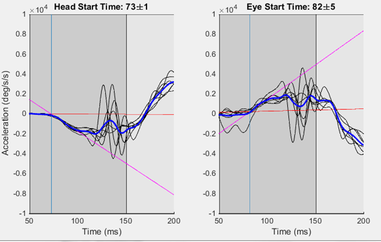
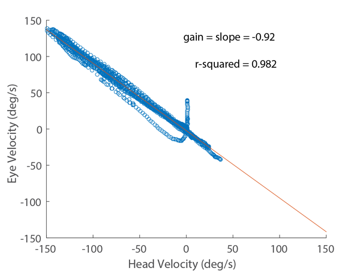
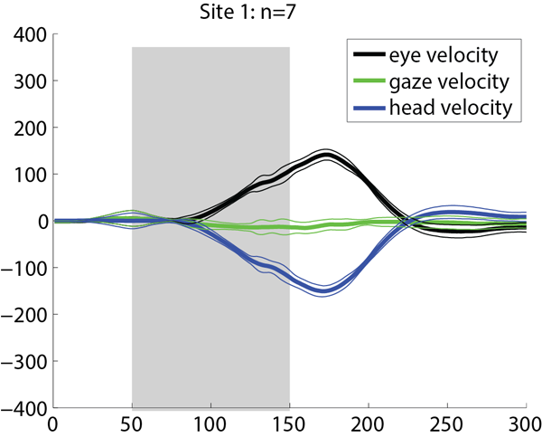
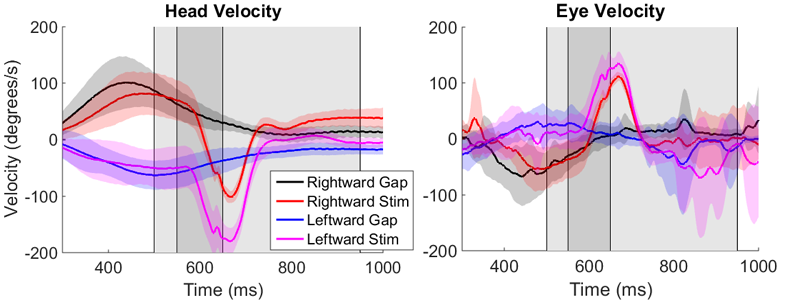

##Introduction
Stimulation of some regions within the rostral portion of the NRG produces ipsilateral, horizontal head rotation. During fixation, these head movements are accompanied by eye counter rotation with a gain less than one. This counter rotation is likely due to the vestibulo-ocular reflex (VOR), which is active during fixation. Stimulation of this region during a gaze shift has been shown to alter the head's contribution to the movement. This is accompanied by changes in eye velocity several times as large as the stimulation-induced changes in head velocity. The magnitude of this change in eye velocity cannot be due to the VOR, which causes eye movements proportional to head velocity with a gain less than or equal to one. Instead, it is consistent with the hypothesized interaction between the head and eye motor commands at the level of the gaze shift burst generator. 

The role of the VOR in coordinating the eyes and head during pursuit is controversial. The VOR may be suppressed, such that compensatory eye movements are only generated with a gain significantly less than one, the VOR may intact with a gain near one, but cancelled by another signal that prevents the eyes from counter-rolling, or the VOR may be both suppressed and cancelled. Testing the system's response to head perturbations has failed to resolve the issue satisfactorily. The results from experiments of this type have been found support both an active and suppressed VOR. Attempts to reconcile these results include hypotheses that allow the VOR to ignore active head movements, while maintaining the ability to cancel unexpected or passive head movements. This means that experiments employing a head brake or other method to physically perturb the head are insufficient to properly test these hypotheses. 

When the NRG is stimulated during gaze shifts, the system responds as though the head motor command were altered. This suggests that electrical stimulation of the NRG can be used to probe the coordination of the eyes and head during pursuit without introducing external, passive head perturbations.

In this experiment, we stimulate the NRG of monkeys while they perform head-unrestrained gaze pursuit. We expect that the stimulation will act as an alteration of the ongoing head motor command and result in altered head movement during pursuit, and will assess how the system responds to such a perturbation. We suggest three hypotheses for this response: (1) there is no interaction between the eyes and head during pursuit. The VOR is not activated by active pursuit-related head movements. Stimulation-induced changes in the head motor command will have no effect on eye movement. (2) The head and eye movement commands interact in a manner similar to what is observed during gaze shifts. Stimulation-induced changes in the head motor command will result in changes in eye movement that do not necessarily depend on the movement of the head. (3) The head and eyes are coordinated by the VOR during pursuit. Eye movement during pursuit is a result of an active eye motor command combined with VOR signals resulting from active head movement. Stimulation-induced alterations in the head motor command will result in changes in the counter-rotation of the eyes that is proportional to the changes in head movement with a latency of 8-10ms.

##Methods
One rhesus monkey participated in this experiment.  This monkey also participated in the experiments described in the previous two chapters, and was familiar with head-unrestrained gaze pursuit and gaze shift tasks. For this experiment, the recording electrode was returned to the same region of the brainstem as in chapter 2, following the methods described in Quessy and Freedman (2004). We chose locations that appeared to produce horizontal head rotation without head roll for further analysis. Stimulation trains were 100ms of 200-300 Hz at 40 micro-amps of current. In this report, we analyzed 11 locations, each on a separate day. At each location, we stimulated during two behavior paradigms, which were interleaved with control trials that were identical except that the stimulator was not activated. We will refer to the two experimental trial types as static stimulation and stimulation during pursuit. 

###Static Stimulation
During static stimulation trials, the subject fixates on a central visual target, and must align the head with the visual target as well. This is accomplished by illuminating a head-mounted laser, aligned with the mid-sagittal plane, which the monkey was trained to align with the visual target. After fixating for a random period of 1000-1500ms, the fixation light was turned off for 50ms (the gap) and the stimulator was turned on for 100ms. After the stimulation train was completed, a second visual target was illuminated 200ms later and the subject was required to make a gaze shift to this target. This gaze shift is not analyzed in this report. Instead, we analyze the period before the second target is illuminated to determine the effect of the stimulation. For control trials, the appearance and disappearance of the visual targets is identical, but no stimulation occurs during the gap.

###Stimulation during Pursuit
We employ a step-ramp paradigm with a step size chosen to allow gaze pursuit to begin without the initial catch-up saccade. We employed a similar paradigm in chapter 1. Subjects begin by fixating on, and aligning the head to a visual target, in a manner identical to the previous trial type. After the random fixation period, the target suddenly makes a step change in position to the left or right, and then begins moving in the opposite direction. For the majority of the trials analyzed here, the target moved at a speed of 40 deg/s, but other speeds were used as well.  During this trial type, the visual target disappears 400ms after it begins moving. After 50ms, the stimulation train is executed, which lasts for 100ms. The target remains invisible for 200 ms after stimulation ends then re-appears, traveling at the same velocity. Since our visual targets are produced by moving robot-mounted lasers, the act of turning the visual target on or off does not affect its position. The effect is that the target appears to have been occluded for 350 ms, but continued to travel at the same velocity while occluded. Subjects receive a juice reward for continuing to follow the target after it reappears. To isolate the effects of stimulation from the effects of a 350 ms target disappearance, we compare these trials to control trials in which the target disappears for an identical amount of time and no stimulation occurs. These trials are interleaved, so the subject cannot guess whether a given trial will contain stimulation or not. 

###Calculating Latency to Stimulation
We define the latency to stimulation of the eyes or head as the amount of time it takes for stimulation to produce eye or head movements. When the eyes and head are stationary, we can use standard methods for detecting movements. However, in our experiment we stimulate while the eyes and head are already moving at a significant speed, so another method must be used. For consistency, we will use the same method to assess both static and pursuit stimulation. 

The figure below shows the following method diagrammatically. We will use an acceleration threshold and regression method to determine when the movement begins. First, we fit a regression line to the acceleration of each trial for the 200ms period before stimulation begins. Next, we average the acceleration for all stimulation trials at a location, and identify the peak acceleration (positive or negative) over the 20ms period beginning when the stimulation starts. To avoid the effect of outliers on the peak acceleration, we will set a threshold of 2/3 the peak velocity and identify the time when the acceleration of each trial exceeds this value. We will then fit a regression line over the 25ms period preceding this time. We define the latency for that trial as the time when these two regression lines intersect. If the calculation yields a negative latency, or a latency greater than 150ms, we count that as a missing value (NaN or NA) and do not include it in later analysis. This most often occurs when there is an extraneous movement, such as a gaze shift, that overlaps with the stimulation period. 



###Calculating VOR gain
We use a method similar to Quessy and Freedman (2004) to calculate the gain of the VOR on each trial. In their study, they calculate the gain of the VOR by computing a linear regression to the eye velocity as a function of head velocity. The slope of the resulting fit is used as a measure of the VOR. They use a subset of the eye and head data for this calculation, either from the beginning to end of the head movement, the beginning of head movement to the end of stimulation, or the time of peak head velocity to the end of the head movement. None of these methods can be adopted in our study, since the head is moving before stimulation, and continues to move long after stimulation ends. Instead, we use the 150ms time period beginning from when the stimulation-induced head movement is detected (see above section for details of how this is calculated). Example below:




##Results
Load the .csv file that was generated using the matlab function NRGAllTABLE

```{r load csv, cache=FALSE,message=FALSE}
filename<-"~/MATLAB/NRGStimAnalysis/LatencyAndVelocityAllStacked.csv"
d <- read.csv(filename, na.strings="NaN")
head(d)
```

This data frame was generated in Matlab and contains latency and peak velocity data from 1026 stimulation trials at 11 locations. It also includes an analysis of the VOR for each trial, and the velocity of control trials for comparison. 

##Stimulation During Fixation
We stimulated each location using a fixation-gap-stim paradigm, in which subjects fixated on a visual target. 50ms after the visual target was extinguished, stimulation began. 



First, we show the latency of the movement of the head and eyes:

```{r latencybylocation, message=FALSE,warning=FALSE}
dfix<-subset(d,d$Dir=='S')
library(ggplot2)
qplot(factor(Loc),Lat,data=dfix,facets=Type~.,geom='boxplot',ylab='Latency (ms)',xlab='Location')+coord_flip()


```

The latency of the two movements is similar, but there is considerably more variance in the eye movement latency.This is likely due to the increased variance in the acceleration of the eyes, which is used to determine the latency of the movements.

Next, we show the peak velocity of the head and eyes.The head movements are to the left (negative), and the eye movements are to the right (positive).


```{r velocity_by_location_fixation}
qplot(factor(Loc),Vel,data=dfix,facets=Type~.,geom='boxplot',ylab='Velocity (deg/s)',xlab='Location')+coord_flip()

```

It is clear that there is a lot of similarity between the evoked movements, which is consistent with our expectation of an in-tact VOR during (and 50ms after) fixation.

Let's see how the compare on a trial-to-trial basis, taking the absolute value of the head velocity:

```{r peak_head_vs_peak_eye_fixation}
ddfix<-data.frame(dfix$Vel[dfix$Type=='E'],dfix$Vel[dfix$Type=='H'])
names(ddfix)<-c("Ev","Hv")
qplot(abs(Hv),Ev,data=ddfix,xlab='abs(Head Velocity)',ylab='Eye Velocity')+stat_smooth(method='lm')
m<-lm(Ev~abs(Hv),data=ddfix)
m
```

There is a strong linear correlation (r-squared = 
`r summary(m)$r.squared`) between head velocity and eye velocity. The eye movements are usually slightly slower than the head movements, but note that the slope is slightly positive (1.078). This suggests that at higher peak head velocities, the eye velocity could exceed head velocity, but we have fewer data points at that level.

###VOR Gain
We calculte the VOR gain using the method from Quessy and Freedman (2004). We compute the linear regression between head and eye velocity for the 150ms period beginning with the detected head movement.

```{r VOR_gain_fixation,message=FALSE,warning=FALSE}
meanvor<-mean(d$VOR[d$Dir=='S'],na.rm=T)
qplot(d$VOR[d$Dir=='S'],xlab='Compensatory Gain')+geom_vline(xintercept=meanvor,col='blue')


```

###Conclusion from Fixation
All of these resulsts are consistent with the hypothesis that the eye movements that we observe upon stimulation are a result of an active VOR. This is as expected, since the animals were actively fixating on a stationary visual target. It is also in agreement with previous studies that stimulated in NRG (Quessy and Freedman 2004). 

A major difference is that these data show a compensatory gain of the VOR around 1, while other studies show VOR gains as low as 0.2 in this region.

##Stimulation During Head-Free Pursuit
Now we will compare these results to stimulation during active head-unrestrained gaze pursuit. Our hypothesis is that the eye movements produced will be the resultFirst we will look for changes in eye movement before the head begins to change its movement in response to stimulation. If we observe such changes in eye movement, we must reject the hypothesis that these movements are due to the VOR.




```{r latency_during_pursuit, message=FALSE,warning=FALSE}
dl<-subset(d,Dir=='L')
dr<-subset(d,Dir=='R')
dlr<-subset(d,Dir!='S')

qplot(factor(Loc),Lat,data=dlr,facets=Type~Dir,geom='boxplot',ylab='Latency (ms)',xlab='Location')+coord_flip()

```

The latency looks similar to what we saw during stimulation after fixation. Again, we see more variance in the measurement of eye latency, but they are similar. There is no evidence of the eyes systematically moving sooer than the head. 

Comparing stimulation during leftward and rightward movements, the latency is slightly longer during rightward movements. This is likely due to the head moving in the opposite direction of the stimulation-induced movement, so it takes longer for the difference to be observable. 

###Velocity
In all of our stimulus locations, we were able to reverse the direction of head movement. In Freedman and Quessy (2004), they found that changes in head velocity during gaze shifts were often accompanied by changes in eye velocity several times greater. If we observe changes in eye velocity that are significantly greater than the changes in head velocity, we should reject the hypothesis that the eye movement changes are due to the VOR.

Below we show the peak eye and head velocities evoked by stimulation during pursuit. The results are similar to stimulation after fixation. We see no evidence of a change in eye velocity that is greater than the change in head velocity.

```{r velocity_during_pursuit}
qplot(factor(Loc),Vel,data=dlr,facets=Type~Dir,geom='boxplot',ylab='Stimulation-Induced Velocity (deg/s)',xlab='Location')+coord_flip()

```

This seems similar to what we saw during fixation, but it is complicated by the gaze pursuit that is occuring while stimulation happens. This is the velocity of the movements at the same time during control trials (no stimulation):

```{r control_velocity}
p<-subset(d,!Dir=='S')
controlv<-ggplot(data=p,aes(factor(Type),cVel, fill=factor(Type)),facets=.~Dir)
controlv+geom_boxplot()+facet_grid(.~Dir)+ylab('Control Velocity (deg/s)')

```

There is more variability in the combination of eye and head movements used to make rightward movements during the gap in pursuit. We can subtract this from the peak velocity we observe on stimulation to obtain the change in velocity produced, or $\Delta V$.

```{r change_in_velocity_during_pursuit}
x<-d
x$cVel[is.na(x$cVel)]=0
deltavall<-ggplot(data=x,aes(factor(Type),Vel-cVel, fill=factor(Type)),facets=.~Dir)
deltavall+geom_boxplot()+facet_grid(.~Dir)+ylab('Stimulation-Induced Change in Velocity (deg/s)')

```


###VOR Gain

We see that stimulation during pursuit produces similar changes in head and eye velocity, whether the subject is pursuing a visual target or not. Next, we will look at the calculated VOR during pursuit. Using the same method as we used to calculate the VOR gain 50ms after fixation.

```{r vor_gain_pursuit, message=FALSE,warning=FALSE}
#Table is doubled for VOR.Just take one set of the identical halves
dsingle<-subset(d,Type=='E')
qplot(VOR,data=dsingle,binwidth=0.05,facets=.~Dir)+coord_cartesian(xlim=c(-1.1,-0.6))

qplot(factor(Dir),VOR,data=dsingle,geom='boxplot')+coord_cartesian(ylim=c(-1.1,-0.6))
fit<-aov(VOR~Dir,data=dsingle)
summary(fit)

```

The F-value for this anova is `r anova(fit)[[4]][1]` which gives a p-value of `r anova(fit)[[5]][1]`. This does not allow us to reject the null hypothesis that the VOR is the same for all three conditions.

##Discussion
In this study, we have assessed the effect of stimulation of the nucleus reticularis gigantocellularis (NRG) during head-unrestrained gaze pursuit. We used microstimulation of the portion of the NRG that produces horizontal head rotation. When this region is stimulated during active head movements, it appears to alter the ongoing head movement command downstream of desired gaze signals. At all of our locations, stimulation produced rapid leftward head rotation. We designed this experiment to test the hypothesis that the eyes and head are coordinated by an active vestibulo-ocular reflex (VOR) during gaze pursuit. This hypothesis provides three predictions about how the system should respond to this perturbation. First, the eyes should compensate for the altered head velocity. Second, the compensatory eye movements should not begin until after the head has changed its acceleration. The latency of the VOR is typically 7-10ms. Third, the magnitude of the compensatory changes in eye velocity should be similar to those observed when stimulation is introduced during fixation. We did not find any evidence in conflict with these predictions. We cannot reject the hypothesis that the eyes and head are coordinated via an active VOR during gaze pursuit.

Alternative hypotheses propose that the eyes and head move independently during pursuit, or that the eyes and head are coordinated through a mechanism other than the VOR. A previous experiment from our lab used microstimulation to probe the coordination of the eyes and head during gaze shifts (Freedman and Quessy 2004). In contrast with our results during pursuit, altering the ongoing head command during gaze shifts resulted in significant changes in eye movement that was not consistent with what the VOR could produce. Our results highlight the importance of keeping evidence from gaze shifts and pursuit separate when considering eye-head coordination.

