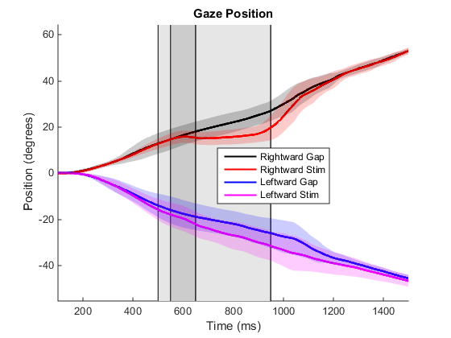

##Introduction
Stimulation of some regions within the rostral portion of the NRG produces ipsilteral, horizontal head rotation. During fixation, these head movements are accompanied by eye counter rotation with a gain less than one. This counter rotation is likely due to the vestibulo-ocular reflex (VOR), which is active during fixation. Stimulation of this region during a gaze shift has been shown to alter the head's contribution to the movement. This is accompanied by changes in eye velocity several times as large as the stimulation-induced changes in head velocity. The magnitude of this change in eye velocity cannot be due to the VOR, which causes eye movements proportional to head velocity with a gain less than or equal to one. Instead, it is consistent with the hypothesized interaction between the head and eye motor commands at the level of the gaze shift burst generator. 

The role of the VOR in coordinating the eyes and head during pursuit is controversial. X X or both. Testing the system's response to head perturbations has failed to resolve the issue satisfactorily. The results from experiments of this type have been found support both an active and suppressed VOR. Attempts to reconcile these results include hypotheses that allow the VOR to ignore active head movements, while maintaining the ability to cancel unexpected or passive head movements. This means that experiments employing a head brake or other method to physically perturb the head are insufficient to properly test these hypotheses. 

When the NRG is stimulted during gaze shifts, the system responds as though the head motor command were altered. This suggests that electrical stimulation of the NRG can be used to probe the coordination of the eyes and head during pursuit without introducing external, passive head perturbations.

In this experiment, we stimulate the NRG of monkeys while they perform head-unrestrained gaze pursuit. We expect that the stimulation will act as an alteration of the ongoing head motor command and result in altered head movement during pursuit, and will assess how the system responds to such a perturbation. We suggest three hypotheses for this response: (1) There is no interaction between the eyes and head during pursuit. The VOR is not activated by active pursuit-related head movements. Stimulation-induced changes in the head motor command will have no effect on eye movement. (2) The head and eye movement commands interact in a manner similar to what is observed during gaze shifts. Stimulation-induced changes in the head motor command will result in changes in eye movement that do not necessarily depend on the movement of the head. (3) The head and eyes are coordinated by the VOR during pursuit. Eye movement during pursuit is a result of an active eye motor command combined with VOR signals resulting from active head movement. Stimulation-induced alterations in the head motor command will result in changes in the counter-rotation of the eyes that is proportional to the changes in head movement with a latency of 8-10ms. 


###Data Processing
Load the .csv file that was generated using the matlab function NRGAllTABLE

```{r, cache=FALSE,message=FALSE}
filename<-"~/MATLAB/NRGStimAnalysis/LatencyAndVelocityAllStacked.csv"
d <- read.csv(filename, na.strings="NaN")
head(d)
```
This data frame was generated in Matlab and contains latency and peak velocity data from 1026 stimulation trials at 11 locations. 

##Stimulation During Fixation
We stimulated each location using a fixation-gap-stim paradigm, in which subjects fixated on a visual target. 50ms after the visual target was extinguished, stimulation began. 


First, we show the latency of the movement of the head and eyes:

```{r,message=FALSE}
dfix<-subset(d,d$Dir=='S')
library(ggplot2)
qplot(factor(Loc),Lat,data=dfix,facets=Type~.,geom='boxplot',ylab='Latency (ms)',xlab='Location')+coord_flip()


```

The latency of the two movements is similar, but there is considerably more variance in the eye movement latency.This is likely due to the increased variance in the acceleration of the eyes, which is used to determine the latency of the movements.

Next, we show the peak velocity of the head and eyes.The head movements are to the left (negative), and the eye movements are to the right (positive).


```{r}
qplot(factor(Loc),Vel,data=dfix,facets=Type~.,geom='boxplot',ylab='Velocity (deg/s)',xlab='Location')+coord_flip()

```

It is clear that there is a lot of similarity between the evoked movements, which is consistent with our expectation of an in-tact VOR during (and 50ms after) fixation.

Let's see how the compare on a trial-to-trial basis, taking the absolute value of the head velocity:

```{r}
ddfix<-data.frame(dfix$Vel[dfix$Type=='E'],dfix$Vel[dfix$Type=='H'])
names(ddfix)<-c("Ev","Hv")
qplot(abs(Hv),Ev,data=ddfix,xlab='abs(Head Velocity)',ylab='Eye Velocity')+stat_smooth(method='lm')
m<-lm(Ev~abs(Hv),data=ddfix)
m
summary(m)$r.squared
```

There is a strong linear correlation (r-squared = 0.9896) between head velocity and eye velocity. The eye movements are usually slightly slower than the head movements, but note that the slope is slightly positive (1.078). This suggests that at higher peak head velocities, the eye velocity could exceed head velocity, but we have fewer data points at that level.

###VOR Gain
We calculte the VOR gain using the method from Quessy and Freedman (2004). We compute the linear regression between head and eye velocity for the 150ms period beginning with the detected head movement.

```{r,message=FALSE}
meanvor<-mean(d$VOR[d$Dir=='S'],na.rm=T)
qplot(d$VOR[d$Dir=='S'],xlab='Compensatory Gain')+geom_vline(xintercept=meanvor,col='blue')


```

###Conclusion from Fixation
All of these resulsts are consistent with the hypothesis that the eye movements that we observe upon stimulation are a result of an active VOR. This is as expected, since the animals were actively fixating on a stationary visual target. It is also in agreement with previous studies that stimulated in NRG (Quessy and Freedman 2004). 

A major difference is that these data show a compensatory gain of the VOR around 1, while other studies show VOR gains as low as 0.2 in this region.

##Stimulation During Head-Free Pursuit
Now we will compare these results to stimulation during active head-unrestrained gaze pursuit. Our hypothesis is that the eye movements produced will be the resultFirst we will look for changes in eye movement before the head begins to change its movement in response to stimulation. If we observe such changes in eye movement, we must reject the hypothesis that these movements are due to the VOR.


```{r, message=FALSE}
dl<-subset(d,Dir=='L')
dr<-subset(d,Dir=='R')
dlr<-subset(d,Dir!='S')

qplot(factor(Loc),Lat,data=dlr,facets=Type~Dir,geom='boxplot',ylab='Latency (ms)',xlab='Location')+coord_flip()

```

The latency looks similar to what we saw during stimulation after fixation. Again, we see more variance in the measurement of eye latency, but they are similar. There is no evidence of the eyes systematically moving sooer than the head. 

Comparing stimulation during leftward and rightward movements, the latency is slightly longer during rightward movements. This is likely due to the head moving in the opposite direction of the stimulation-induced movement, so it takes longer for the difference to be observable. 

###Velocity
In all of our stimulus locations, we were able to reverse the direction of head movement. In Freedman and Quessy (2004), they found that changes in head velocity during gaze shifts were often accompanied by changes in eye velocity several times greater. If we observe changes in eye velocity that are significantly greater than the changes in head velocity, we should reject the hypothesis that the eye movement changes are due to the VOR.

Below we show the peak eye and head velocities evoked by stimulation during pursuit. The results are similar to stimulation after fixation. We see no evidence of a change in eye velocity that is greater than the change in head velocity.

```{r}
qplot(factor(Loc),Vel,data=dlr,facets=Type~Dir,geom='boxplot',ylab='Velocity (deg/s)',xlab='Location')+coord_flip()

```

This seems similar to what we saw during fixation, but it is complicated by the gaze pursuit that is occuring while stimulation happens. This is the velocity of the movements at the same time during control trials (no stimulation):

```{r}
p<-subset(d,!Dir=='S')
controlv<-ggplot(data=p,aes(factor(Type),cVel, fill=factor(Type)),facets=.~Dir)
controlv+geom_boxplot()+facet_grid(.~Dir)

```

There is more variability in the combination of eye and head movements used to make rightward movements during the gap in pursuit. We can subtract this from the peak velocity we observe on stimulation to obtain the change in velocity produced, or $\Delta V$.

```{r}
x<-d
x$cVel[is.na(x$cVel)]=0
deltavall<-ggplot(data=x,aes(factor(Type),Vel-cVel, fill=factor(Type)),facets=.~Dir)
deltavall+geom_boxplot()+facet_grid(.~Dir)

```


###VOR Gain

```{r, message=FALSE}
qplot(VOR,data=d,facets=Dir~.,binwidth=0.01)+coord_cartesian(xlim=c(-1.1,-0.6))

#m<-aggregate(d$Vel,list(Loc=d$Loc,Dir=d$Dir,Type=d$Type),mean)
#me<-subset(m,Type=='E')
#mh<-subset(m,Type=='H')
#mm<-me
#mm$E<-mm$x
#mm$H<-mh$x

```


###Gaze Velocity
Look directly at how fast gaze is changing during stimulation by adding the peak eye and head velocities together. During pursuit, the visual target is moving at 40 degrees/s. During leftward movements, the average velocity stays around 40 deg/s. In contrast, during rightward movements, gaze velocity slows to just slightly above zero. 
```{r}
#Unstack the table to compare head/eye from same trial
dd<-data.frame(d$Vel[d$Type=='E'],d$Vel[d$Type=='H'])
names(dd)<-c("Ev","Hv")
dd$Dir<-d$Dir[d$Type=='E']
dd$CEVel<-d$cVel[d$Type=='E']
dd$CHVel<-d$cVel[d$Type=='H']
dd$Loc<-d$Loc[d$Type=='E']
dd$CEVel[dd$Dir=='S']=0
dd$CHVel[dd$Dir=='S']<-0

qplot(factor(Loc),Ev+Hv,facets='.~Dir',data=dd)+geom_hline(yintercept=40)+geom_hline(yintercept=-40)+geom_boxplot()
```

It looks like during leftward movements, gaze stays very close to 40 deg/s, which is the speed of the target. During rightward movements, gaze velocity is reduced. 

We can subtract the gaze velocity from control trials to look at the stimulation-induced change in gaze velocity:


```{r}
qplot(factor(Loc),Ev+Hv-(CEVel+CHVel),facets='.~Dir',data=dd,ylab='Change in Gaze Velocity')+geom_hline(yintercept=40)+geom_hline(yintercept=-40)+geom_boxplot()+coord_cartesian(ylim=c(-50,50))
qplot(factor(Dir),Ev+Hv-(CEVel+CHVel),data=dd,ylab='Change in Gaze Velocity')+geom_hline(yintercept=40)+geom_hline(yintercept=-40)+geom_boxplot()+coord_cartesian(ylim=c(-50,50))

```

From this, it does appear that stimulation has a greater effect on gaze velocity during rightward pursuit. Under these circumstances, we are moving the head in the opposite direction of pursuit. How is that different? Below is a picture of gaze position during pursuit and stimulation:


