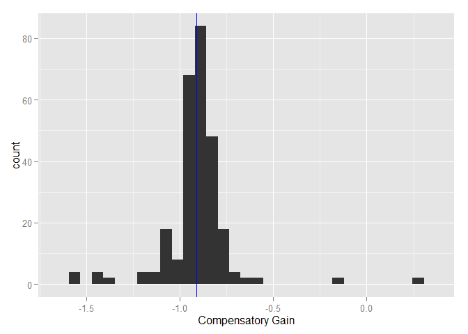
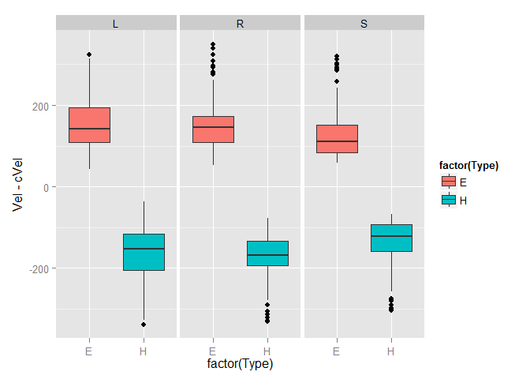

# Analysis of NRG Stimulation during Pursuit
##Synopsis
In this report, we look at the effect of stimulating the rostral portion of NRG during pursuit. We identified 11 regions that produce leftward, horizontal head rotation upon stimulation when the head is stationary, and assess the impact of stimulating this region during pursuit. 

###Data Processing
Load the .csv file that was generated using the matlab function NRGAllTABLE


```r
filename<-"~/MATLAB/NRGStimAnalysis/LatencyAndVelocityAllStacked.csv"
d <- read.csv(filename, na.strings="NaN")
head(d)
```

```
##   Lat       Vel        VOR Type Dir Loc     cVel
## 1  18 -246.3858 -0.8715360    H   L   1 -47.6094
## 2  19 -172.3262 -1.0097302    H   L   1 -47.6094
## 3  15 -169.7431 -0.7976775    H   L   1 -47.6094
## 4  19 -171.6614 -0.9326004    H   L   1 -47.6094
## 5  21 -156.4680 -0.8863773    H   L   1 -47.6094
## 6  13 -191.7267 -0.9535981    H   L   1 -47.6094
```
This data frame was generated in Matlab and contains latency and peak velocity data from 1026 stimulation trials at 11 locations. 

##Stimulation During Fixation
We stimulated each location using a fixation-gap-stim paradigm, in which subjects fixated on a visual target. 50ms after the visual target was extinguished, stimulation began. 

First, we show the latency of the movement of the head and eyes:


```r
dfix<-subset(d,d$Dir=='S')
library(ggplot2)
```

```
## Warning: package 'ggplot2' was built under R version 3.1.2
```

```r
qplot(factor(Loc),Lat,data=dfix,facets=Type~.,geom='boxplot',ylab='Latency (ms)',xlab='Location')+coord_flip()
```

```
## Warning: Removed 9 rows containing non-finite values (stat_boxplot).
```

 

The latency of the two movements is similar, but there is considerably more variance in the eye movement latency.This is likely due to the increased variance in the acceleration of the eyes, which is used to determine the latency of the movements.

Next, we show the peak velocity of the head and eyes.The head movements are to the left (negative), and the eye movements are to the right (positive).


```r
qplot(factor(Loc),Vel,data=dfix,facets=Type~.,geom='boxplot',ylab='Velocity (deg/s)',xlab='Location')+coord_flip()
```

 

It is clear that there is a lot of similarity between the evoked movements, which is consistent with our expectation of an in-tact VOR during (and 50ms after) fixation.

Let's see how the compare on a trial-to-trial basis, taking the absolute value of the head velocity:


```r
ddfix<-data.frame(dfix$Vel[dfix$Type=='E'],dfix$Vel[dfix$Type=='H'])
names(ddfix)<-c("Ev","Hv")
qplot(abs(Hv),Ev,data=ddfix,xlab='abs(Head Velocity)',ylab='Eye Velocity')+stat_smooth(method='lm')
```

 

```r
m<-lm(Ev~abs(Hv),data=ddfix)
m
```

```
## 
## Call:
## lm(formula = Ev ~ abs(Hv), data = ddfix)
## 
## Coefficients:
## (Intercept)      abs(Hv)  
##     -17.731        1.078
```

```r
summary(m)$r.squared
```

```
## [1] 0.989645
```

There is a strong linear correlation (r-squared = 0.9896) between head velocity and eye velocity. The eye movements are usually slightly slower than the head movements, but note that the slope is slightly positive (1.078). This suggests that at higher peak head velocities, the eye velocity could exceed head velocity, but we have fewer data points at that level.
###VOR Gain
We calculte the VOR gain using the method from Quessy and Freedman (2004). We compute the linear regression between head and eye velocity for the 150ms period beginning with the detected head movement.


```r
meanvor<-mean(d$VOR[d$Dir=='S'],na.rm=T)
qplot(d$VOR[d$Dir=='S'],xlab='Compensatory Gain')+geom_vline(xintercept=meanvor,col='blue')
```

```
## stat_bin: binwidth defaulted to range/30. Use 'binwidth = x' to adjust this.
```

 

###Conclusion from Fixation
All of these resulsts are consistent with the hypothesis that the eye movements that we observe upon stimulation are a result of an active VOR. This is as expected, since the animals were actively fixating on a stationary visual target. It is also in agreement with previous studies that stimulated in NRG (Quessy and Freedman 2004). 

A major difference is that these data show a compensatory gain of the VOR around 1, while other studies show VOR gains as low as 0.2 in this region.

##Stimulation During Head-Free Pursuit
Now we will compare these results to stimulation during active head-unrestrained gaze pursuit. Our hypothesis is that the eye movements produced will be the resultFirst we will look for changes in eye movement before the head begins to change its movement in response to stimulation. If we observe such changes in eye movement, we must reject the hypothesis that these movements are due to the VOR.


```r
dl<-subset(d,Dir=='L')
dr<-subset(d,Dir=='R')
dlr<-subset(d,Dir!='S')
qplot(factor(Loc),Lat,data=dlr,facets=Type~Dir,geom='boxplot',ylab='Latency (ms)',xlab='Location')+coord_flip()
```

```
## Warning: Removed 43 rows containing non-finite values (stat_boxplot).
```

```
## Warning: Removed 10 rows containing non-finite values (stat_boxplot).
```

```
## Warning: Removed 2 rows containing non-finite values (stat_boxplot).
```

 

The latency looks similar to what we saw during stimulation after fixation. Again, we see more variance in the measurement of eye latency, but they are similar. There is no evidence of the eyes systematically moving sooer than the head. 

Comparing stimulation during leftward and rightward movements, the latency is slightly longer during rightward movements. This is likely due to the head moving in the opposite direction of the stimulation-induced movement, so it takes longer for the difference to be observable. 

###Velocity
In all of our stimulus locations, we were able to reverse the direction of head movement. In Freedman and Quessy (2004), they found that changes in head velocity during gaze shifts were often accompanied by changes in eye velocity several times greater. If we observe changes in eye velocity that are significantly greater than the changes in head velocity, we should reject the hypothesis that the eye movement changes are due to the VOR.

Below we show the peak eye and head velocities evoked by stimulation during pursuit. The results are similar to stimulation after fixation. We see no evidence of a change in eye velocity that is greater than the change in head velocity.


```r
qplot(factor(Loc),Vel,data=dlr,facets=Type~Dir,geom='boxplot',ylab='Velocity (deg/s)',xlab='Location')+coord_flip()
```

 

This seems similar to what we saw during fixation, but it is complicated by the gaze pursuit that is occuring while stimulation happens. This is the velocity of the movements at the same time during control trials (no stimulation):


```r
p<-subset(d,!Dir=='S')
controlv<-ggplot(data=p,aes(factor(Type),cVel, fill=factor(Type)),facets=.~Dir)
controlv+geom_boxplot()+facet_grid(.~Dir)
```

 

There is more variability in the combination of eye and head movements used to make rightward movements during the gap in pursuit. We can subtract this from the peak velocity we observe on stimulation to obtain the change in velocity produced, or $\{delta}V$.


```r
deltav<-ggplot(data=p,aes(factor(Type),Vel-cVel, fill=factor(Type)),facets=.~Dir)
deltav+geom_boxplot()+facet_grid(.~Dir)
```

 


```r
#make this data frame to compare eye and head on the same trial. The original data frame is organized so the trials are in order
ddp<-data.frame(dlr$Vel[dlr$Type=='E'],dlr$Vel[dlr$Type=='H'])
names(ddp)<-c("Ev","Hv")
ddp$Dir<-dlr$Dir[dlr$Type=='E']

qplot(abs(Hv),Ev,data=ddp,facets=Dir~.,xlab='abs(Head Velocity)',ylab='Eye Velocity')+stat_smooth(method='lm')
```

 

```r
m<-lm(Ev~abs(Hv),data=ddp)
m
```

```
## 
## Call:
## lm(formula = Ev ~ abs(Hv), data = ddp)
## 
## Coefficients:
## (Intercept)      abs(Hv)  
##     16.0094       0.8205
```

```r
summary(m)$r.squared
```

```
## [1] 0.8097008
```


###VOR Gain

```r
qplot(factor(Dir),VOR,geom='boxplot',data=d)
```

```
## Warning: Removed 128 rows containing non-finite values (stat_boxplot).
```

 

```r
#m<-aggregate(d$Vel,list(Loc=d$Loc,Dir=d$Dir,Type=d$Type),mean)
#me<-subset(m,Type=='E')
#mh<-subset(m,Type=='H')
#mm<-me
#mm$E<-mm$x
#mm$H<-mh$x
```


```r
dd<-data.frame(d$Vel[d$Type=='E'],d$Vel[d$Type=='H'])
names(dd)<-c("Ev","Hv")
dd$Dir<-d$Dir[d$Type=='E']
qplot(abs(Hv),Ev,data=dd,facets=Dir~.,xlab='abs(Head Velocity)',ylab='Eye Velocity')+stat_smooth(method='lm')
```

 

```r
m<-lm(Ev~abs(Hv),data=ddp)
m
```

```
## 
## Call:
## lm(formula = Ev ~ abs(Hv), data = ddp)
## 
## Coefficients:
## (Intercept)      abs(Hv)  
##     16.0094       0.8205
```

```r
summary(m)$r.squared
```

```
## [1] 0.8097008
```


###Gaze Velocity
Look directly at how fast gaze is changing during stimulation by adding the peak eye and head velocities together. During pursuit, the visual target is moving at 40 degrees/s. During leftward movements, the average velocity stays around 40 deg/s. In contrast, during rightward movements, gaze velocity slows to just slightly above zero. 

During fixation, gaze moves left. 

We are complicating things by comparing across all locations here. It's possible that the location that produces the highest head velocities may have different VOR gain. VOR gain during stimulation has been shown to depend on stimulus location.


```r
qplot(Hv,Ev+Hv,data=dd,facets=.~Dir,xlab='Head Velocity',ylab='Eye+Head (Gaze) Velocity')+stat_smooth(method='lm')+geom_hline(yintercept=40)+geom_hline(yintercept=-40)
```

 
